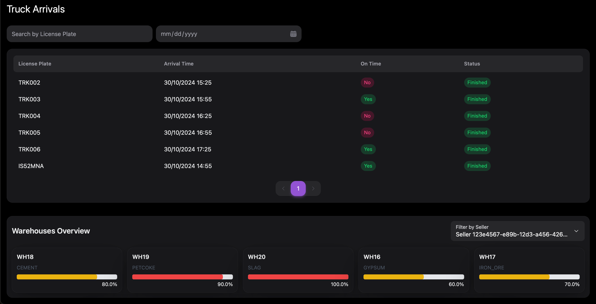

# Warehouse Management System 

### Created using NextUI

---
## Home Page

- ### Home Page for unauthenticated users

- ### Trying to access the dashboard or Make Appointment Page without logging in

- ### Home Page for authenticated users

---
## Make Appointment Page

---
## Dashboard
- ### Trucks on site and their positions
    - Entered = Just Entered The Facility
    - Docked = Docked at one of the warehouses
    - Exited = Just Exited The Facility
    - Bridge = On the weighing bridge
  

- ### Truck Arrivals
  - Shows the trucks that have arrived at the facility (Payload Delivery Tickets)

- ### Truck Arrivals Filtered On Date

- ### Truck Arrivals searched by License Plate for that date

- ### Details of truck arrival

--- 
## Warehouses Overview

- ### All warehouses

- ### Warehouses Filtered On Seller Id

- ### Warehouse Details

# Backend
# Key Aggregates

## Purchase Order
The [`PurchaseOrder`](backend/Warehousing/src/main/java/be/kdg/prog6/warehouse/domain/PurchaseOrder.java) aggregate is responsible for managing purchase orders within the system. It includes details such as the date of the order, customer information, and the list of items being ordered.

## Warehouse
#### The [`Warehouse`](backend/Warehousing/src/main/java/be/kdg/prog6/warehouse/domain/Warehouse.java) aggregate manages the inventory and operations of the warehouse. It includes details about the warehouse's location, capacity, and the items stored within it.
 
- Event Catalog for this object: [`StockMovementWindows`](backend/Warehousing/src/main/java/be/kdg/prog6/warehouse/domain/StockMovementWindow.java)
- To determine the current stock in a warehouse, all the  [`StockMovement`](backend/Warehousing/src/main/java/be/kdg/prog6/warehouse/domain/StockMovement.java) are added to the `Base Stock` of the warehouse which is snapshot every 100 movements ( rn every 1 to test)
- When the stock is updated, the new stock is sent to and projected in Landside [WarehouseEventPublisher](backend/Warehousing/src/main/java/be/kdg/prog6/warehouse/adapters/out/WarehouseEventPublisher.java) and [WarehouseCapacityUpdatedListener](backend/Landside/src/main/java/be/kdg/prog6/Landside/adapters/in/WarehouseCapacityUpdatedListener.java)

## Hourly Schedule 
The [`HourlySchedule`](backend/Landside/src/main/java/be/kdg/prog6/Landside/domain/HourlySchedule.java) aggregate is responsible for managing the hourly schedule of the warehouse. It includes details such as the date and time of the schedule, the seller id, the warehouse and the material type

## Payload Delivery Ticket
The [`PayloadDeliveryTicket`](backend/Landside/src/main/java/be/kdg/prog6/Landside/domain/PayloadDeliveryTicket.java) aggregate is responsible for holding information about the delivery.

- When a Truck finishes to deliver the Raw Materials ([PayloadDeliveryTicketPublisher](backend/Landside/src/main/java/be/kdg/prog6/Landside/adapters/out/PayloadDeliveryTicketPublisher.java)) a PDT is sent to Warehousing Context so that the warehouse can receive the materials and update the stock. [RawMaterialsReceivedListener](backend/Warehousing/src/main/java/be/kdg/prog6/warehouse/adapters/in/RawMaterialsReceivedListener.java)

---
## For testing the functionality of the system, you can use the following http requests:
- [buyer scenario](backend/Landside/src/test/security/buyer_scenario.http)
- [frontend endpoints](backend/Landside/src/test/security/frontend_endpoints.http)
- [seller scenario](backend/Landside/src/test/security/seller_scenario.http)

